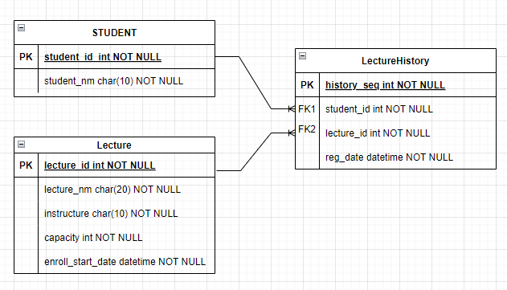
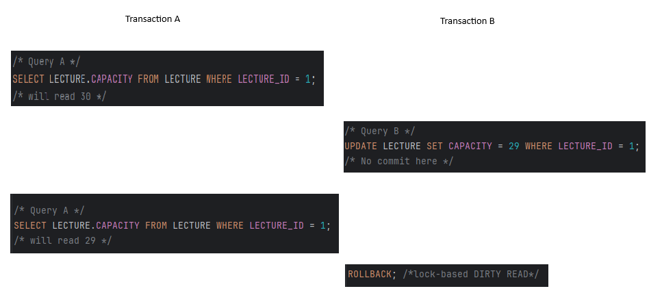
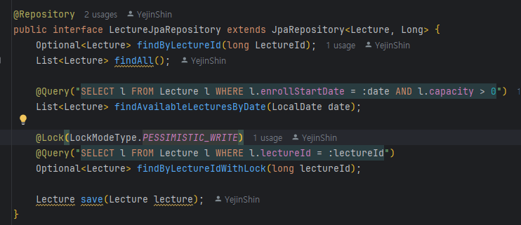
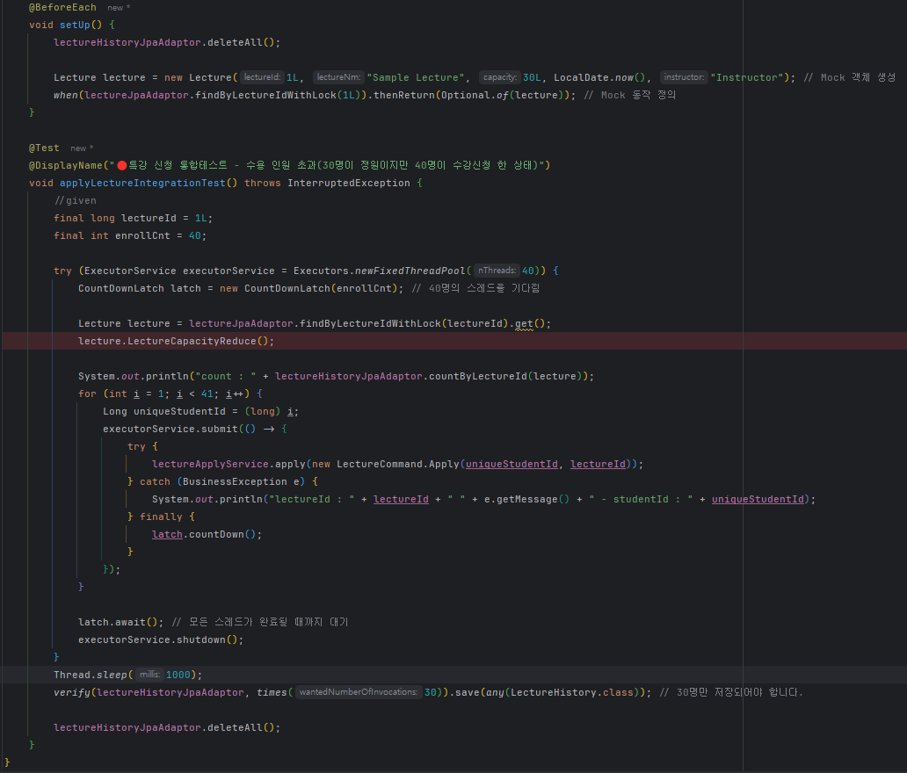
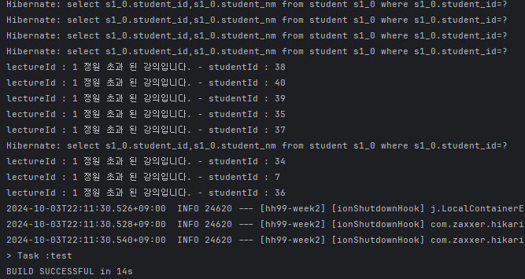
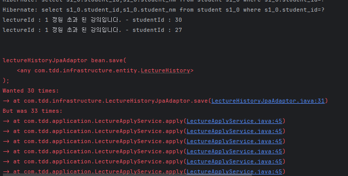

# 🏫 특강 신청 서비스 

## 요구사항 
## ✔️Description

- `특강 신청 서비스`를 구현해 봅니다.
- 항해 플러스 토요일 특강을 신청할 수 있는 서비스를 개발합니다.
- 특강 신청 및 신청자 목록 관리를 RDBMS를 이용해 관리할 방법을 고민합니다.

## ✔️Requirements

- 아래 2가지 API 를 구현합니다.
    - 특강 신청 API
    - 특강 신청 여부 조회 API
- 각 기능 및 제약 사항에 대해 단위 테스트를 반드시 하나 이상 작성하도록 합니다.
- 다수의 인스턴스로 어플리케이션이 동작하더라도 기능에 문제가 없도록 작성하도록 합니다.
- 동시성 이슈를 고려 하여 구현합니다.

## ️️✔️API Specs

1️⃣ **(핵심)** 특강 신청 **API**

- 특정 userId 로 선착순으로 제공되는 특강을 신청하는 API 를 작성합니다.
- 동일한 신청자는 동일한 강의에 대해서 한 번의 수강 신청만 성공할 수 있습니다.
- 특강은 선착순 30명만 신청 가능합니다.
- 이미 신청자가 30명이 초과되면 이후 신청자는 요청을 실패합니다.

**2️⃣ 특강 선택 API**

- 날짜별로 현재 신청 가능한 특강 목록을 조회하는 API 를 작성합니다.
- 특강의 정원은 30명으로 고정이며, 사용자는 각 특강에 신청하기전 목록을 조회해볼 수 있어야 합니다.

3️⃣  **특강 신청 완료 목록 조회 API**

- 특정 userId 로 신청 완료된 특강 목록을 조회하는 API 를 작성합니다.
- 각 항목은 특강 ID 및 이름, 강연자 정보를 담고 있어야 합니다.

## ✔️Spec 
### ▪️ DBMS : MySql 8.0
### ▪️ Java Version : 21 
### ▪️ SpringFramework Boot : 3.3.4
## ✔️테이블 설계 
### 설계시 세운 원칙 
1️⃣ 최대한 간결한 데이터 구조를 만들 것. 
2️⃣ 최대한 테이블 간의 의존이 없게 PK와 FK 를 id값으로 설정하기.

### 요구사항 분석 
1. userId가 제공됨 => userId가 저장되는 Student 테이블이 필요하다고 생각.
2. 날짜별 신청 가능한 특강 목록 조회 => 특강 신청 날짜(enroll_start_date)
 처음엔 enroll_end_date 도 넣어서 특정 날짜를 넣었을 때 <code>enroll_start_date</code>~<code>enroll_end_date</code>사이에 있으면서 신청인원이 마감되지 않은 리스트를 뽑으려고했다. 
     기간 사이의 조회는 현재 서비스에서 중요한 기능은 아닌 것 같아 최대한 심플하게 테이블을 구성하려고했다. 
3. 완료 목록 조회 => 신청에 성공하면 history를 남겨야한다.   요구사항에서 취소에 관한 내용은 없었으므로 성공한 케이스만 담는 히스토리테이블을 만들기로했다.
4. 신청자에 대한 필드값이 30명으로 고정이지만, 테스트의 유연성 + 이후 코드의 확장성 등을 고려해 <code>capacity</code>라는 컬럼을 추가하였다.   해당 컬럼은 수강신청에 성공하면 즉시 1씩 차감된다.

### ERD

1. STUDENT : 학생 정보 저장
   * <code>STUDENT_ID</code>: 학생의 고유 식별자로, 각 학생을 식별하는 기본 키 역할.
   * <code>STUDENT_NM</code>: 학생의 이름을 저장.
2. LECTURE
   * <code>LECTURE_ID</code>: 강의의 고유 식별자. 자동 증가(AUTO_INCREMENT)를 사용하여 중복되지 않는 값을 자동 생성함.
   * <code>CAPACITY</code>: 해당 강의의 최대 수용 인원. / 기본값 30명.
   * <code>ENROLL_START_DATE</code>: 강의 신청이 가능한 시작 날짜.
   * <code>INSTRUCTOR</code>: 강의를 진행하는 강사의 이름.
3. LECTUREHISTORY
   * <code>HISTORY_ID</code>: 신청 이력의 고유 식별자로, 자동 증가(AUTO_INCREMENT).
   * <code>STUDENT_ID</code>: 신청한 학생의 식별자로, STUDENT 테이블의 STUDENT_ID를 참조.  외래 키(FK)로 설정되며, 학생이 삭제되면 관련 신청 이력도 삭제됨(ON DELETE CASCADE).
   * <code>LECTURE_ID</code>: 신청한 강의의 식별자로, LECTURE 테이블의 LECTURE_ID를 참조.  외래 키(FK)로 설정되며, 강의가 삭제되면 관련 신청 이력도 삭제됨(ON DELETE CASCADE).
   * <code>REG_DATE</code>: 강의 신청이 이루어진 날짜와 시간을 저장.

### 테이블 간의 관계 
#### LectureHistrory <-> Lecture : 각 신청 이력은 특정 강의와 연결되어있으며, 강의가 삭제되면 해당 강의와 관련된 신청이력도 함께 사라짐. 
#### LectureHistory <-> Student : 각 신청 이력은 특정 학생과 연결되어있으며, 학생이 삭제되면 해당 학생과 관련된 신청이력도 함께 사라짐.

## 💡 동시성 제어

### 1) Dirty Read에 대한 이해 
- 📝 Capacity(Default : 30명)를 초과할 경우 요청(특강신청)을 수행하면 안됨. 
- 특강 신청 <code>LectureApplyService.apply()</code>를 수행할 경우 command객체로 받은 <code>lecture_id</code>로 <code>LECTURE</code>테이블에서 특강 정보를 불러온다. 
- 동시에 <code>LECTURE</code>테이블에 접근하여 같은 특강에 대해 <code>capacity</code>를 조회할 때 lock이 걸려있지 않으면 커밋 되지 않은 처음 데이터를 읽은 후 U/D를 수행하는 <code>Dirty Read</code> 문제가 발생할 수 있다.

 

### 2) 비관적 락(Pessimistic Lock) vs 낙관적 락 (Optimistic Lock)
* Optimistic Lock 
  * DB Lock을 사용하지 않고 Version관리를 통해 애플리케이션 레벨에서 처리. 
  * 대부분의 트랜잭션이 충돌하지 않는다고 가정하는 방법
  * DB의 Lock기능을 이용하지 않고, JPA가 제공하는 버전 관리 기능을 사용.
  * 트랜잭션 커밋 전에는 트랜잭션 충돌을 알 수 없다. 

* Pessimistic Lock 
  * 모든 트랜잭션은 충돌이 발생한다고 가정하고 우선 Lock을 거는 방법. 
  * DB의 Lock기능을 이용한다. 주로 <code>select for update</code>구문을 사용하고 버전 정보는 사용하지 않는다. 
  * 트랜잭션 커밋 전, 데이터를 수정하는 시점에 미리 트랜잭션 충돌을 감지할 수도 있다. 
  * Lock을 획득할 때 까지 트랜잭션은 대기하므로 Timeout을 설정할 수도 있다. 

### 3) 비관적 락 + 베타 락(Exclusive Lock/ x-Lock)
* 데이터를 변경할 때 사용된다. 
* 다른 Lock들과 호환되지 않기 때문에 한 리소스에 하나의 x-lock만 설정 가능하다. 
* x-Lock은 동시에 여러 트랜잭션이 한 리소스에 엑세스 할 수 없게 된다. 읽기도 안됨.  
* 오직 하나의 트랜잭션만 해당 리소스를 점유할 수 있다. 

 아래 소스에서 <code>@Lock(LockModeType.PESSIMISTIC_WRITE)</code> 을 이용해서 베타 락을 걸 수 있다. 

### 4) 그럼 비관적 락은 데드락(Dead Lock)이 발생하지 않을까? 
단순하게 먼저 접근하는 트랜잭션이 row에 락을 걸어버리니까 데드락 문제가 발생할 수 없을거라고 생각했다. 
하지만 비관적 락을 적용해도 상황에 따라 데드락 문제는 발생할 수 있다.
> 1. 트랜잭션 A가 table1의 1번 데이터 row에 Lock을 건다. 
> 2. 트랜잭션 B가 table2의 1번 데이터 row에 Lock을 건다.
> 3. 트랜잭션 A가 table2의 1번 데이터 row에 접근한다. 
>   3-1. 트랜잭션 B가 이미 Lock을 걸어놔서 대기중. 
> 4. 트랜잭션 B가 table1의 1번 데이터 row에 접근한다.  
>   4-1. 트랜잭션 A가 이미 Lock을 걸어놔서 대기한다. 

이런식으로 서로 다른 트랜잭션이 각자 자원을 점유하고 서로의 자원을 얻기위해 무한 대기하는 데드락이 발생한다. 
현재 프로젝트에서는 싱글 DB이기 때문에 적용되지 않는 문제라고 하나, 분산 DB환경이라면 "샤딩" 또는 "Replication" 등을 통해 해결할 수 있다고 한다. 

### 5) 테스트 코드 

* <code>java.util.concurrent.CountDownLatch(int count)</code>(다른 스레드를 기다리는 방법) : 주어진 카운트로 초기화 된다.  
<code>await</code>메서드를 실행하면 해당 스레드는 다른 스레드에서 CountDown 메서드 호출로 인해 현재 카운트가 0이 될 때 까지 대기한다.  
 그 후에는 대기 중인 스레드가 해제된다. 
* 30명 정원을 설정해 두고 40개의 스레드를 실행하였다. > 간혹 성공하는 경우도 있지만 30 이상으로 실행되는 경우도 있다.
* Lecture테이블이 Transaction으로 점거당하고 있어 같은 레벨의 스레드들이 capacity를 <code>null</code>로 불러오는 현상이 계속 발생하였다. 
    * <code>LectureJpaAdaptor</code>를 mocking 하여 가상 객체를 만든 후 테스트를 하여 해결하였다. 

**[성공케이스]**  
  
**[실패케이스]**
## 풀리지 않는 의문 
- 왜 테스트가 간헐적으로 성공, 실패가 되는것일까? 

